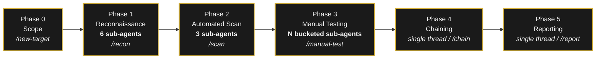

<div align="center">

```text
     _      _   _                 _
    | | ___| |_| |__   __ _ _ __ (_)
    | |/ _ \ __| '_ \ / _` | '_ \| |
    | |  __/ |_| | | | (_| | | | | |
    |_|\___|\__|_| |_|\__,_|_| |_|_|

    >---[ 6C 65 74 68 61 6E 69 ]----------->
              every move, deliberate
```

[](LICENSE)
[](https://claude.com/claude-code)
[](#)
[](https://www.kali.org)
[](examples/demo.gif)

<br>


<!-- Optionally also upload to asciinema.org and add:
     [](https://asciinema.org/a/REC_ID)
-->
<!-- After you push to GitHub, replace USER below with your handle and uncomment:
[](https://github.com/onurogut/lethani/commits/main)
-->

</div>

> *"The Lethani is a path one walks. It is the right action moving from the
> right heart, the right mind."* — Vashet, *The Wise Man's Fear*

### Why the name?

In Patrick Rothfuss's *Kingkiller Chronicle*, the Adem mercenaries follow the
**Lethani** — not a moral code, exactly, but a felt sense of *the right
action* in any given moment. They are paid killers, yet every motion is
deliberate; nothing is wasted; nothing is reckless. That is the discipline
this tool tries to inherit. Offensive security work, done well, is the same:
authorized, deliberate, evidenced, and never gratuitous. lethani is named for
that posture, and tries to enforce it in its defaults — confirm scope by
writing it down, fan work out only where it helps, surface critical findings
the moment they exist, and stop at the first irreversible operator-side
action.

---

An **agentic bug bounty and penetration testing orchestrator** packaged as a
Claude Code plugin. lethani turns ad-hoc engagement work into a phase-aligned,
playbook-driven workflow that fans parallelizable steps out to sub-agents,
keeps the context window under 40K tokens, and treats authorization as
implicit — it is a tool, not a junior consultant.

---

## What lethani does

- **Phase-aligned playbooks** — 51 markdown playbooks covering recon,
  automated scanning, manual vuln testing, vulnerability chaining, and
  reporting. Each is a deterministic procedure with steps, output format,
  and pass/fail criteria.
- **Agentic by default** — Phase 1 (14 independent sources) fans out to 6
  parallel sub-agents; Phase 2 to 3; Phase 3 buckets endpoints across N.
  Phases 4 and 5 are single-threaded synthesis.
- **Kali-as-execution-plane** — every active command runs on Kali Linux via
  the `kali-ssh` MCP server. The host edits files and brokers decisions; it
  does not run scans directly.
- **Authorization is implicit** — when you invoke lethani, you have already
  decided the target is authorized. lethani does not re-ask before each
  kali-ssh call or before Phase 1. Confirmation is reserved for irreversible
  operations on your own machine (`rm -rf`, force-push, deleting engagement
  dirs).
- **Context budget enforced** — < 40K tokens per session. Detailed reference
  lives in `00_infra/` and loads only on demand.
- **Learning Mode** — pulls fresh techniques from curated public sources
  (PortSwigger, watchTowr, Assetnote, HackTricks, PayloadsAllTheThings,
  HackerOne hacktivity, nuclei-templates, CISA KEV, …), filters by a hard
  quality bar, and proposes playbook patches that require your approval
  before any file is written.
- **Anonymous reporting** — reports use `Tester : [redacted]` by default.

---

## Install

### Option A — as a Claude Code plugin (recommended)

```
/plugin install github:onurogut/lethani
```

This makes the slash commands (`/new-target`, `/recon`, `/scan`, …) available
in any Claude Code session. The plugin metadata is in `.claude-plugin/`.

### Option B — as a workspace

```bash
git clone https://github.com/onurogut/lethani.git ~/lethani
cd ~/lethani
claude
```

Use this when you want the engagement directory, behavior rules
(`00_infra/behavior_rules.md`), and the CLAUDE.md router all loaded in the
session context, not just the plugin commands.

Both modes coexist — installing the plugin and `cd ~/lethani` in the same
session gives you the slash commands plus the workspace-level routing.

---

## First-run setup (Kali + MCP)

```bash
# host-side: SSH key, ~/.ssh/config block, MCP sample config
./00_infra/scripts/setup-host.sh

# kali-side: install the tool inventory the playbooks expect
scp 00_infra/scripts/setup-kali.sh talon-kali:/tmp/
ssh talon-kali "bash /tmp/setup-kali.sh"
```

Full details and troubleshooting: [SETUP.md](SETUP.md).

---

## First engagement

In Claude Code:

```
/new-target acme.com
/recon acme
```

lethani will:

1. Scaffold `engagements/acme/` with a `scope.md` template (Phase 0).
2. Fan out Phase 1 to 6 parallel sub-agents (DNS, HTTP, params/CICD,
   network OSINT, people OSINT, source OSINT).
3. Drop findings into `engagements/acme/recon/` and a summary in
   `recon/_summary.md`.

It will **not** ask "is this in scope?" before running. You created the
engagement; that is the authorization record (`behavior_rules.md` §1).

Continue through phases:

```
/scan acme           # Phase 2 — cve-match + nuclei + ffuf
/manual-test acme    # Phase 3 — bucketed manual testing
/chain acme          # Phase 4 — vulnerability chaining (single-threaded)
/report acme         # Phase 5 — duplicate check + severity + report
```

---

## Plugin commands

| Command          | What it does                                                    |
|------------------|-----------------------------------------------------------------|
| `/new-target <t>`| Scaffold engagement dir + scope.md template                     |
| `/recon <t>`     | Phase 1 reconnaissance, fanned out to 6 sub-agents              |
| `/scan <t>`      | Phase 2 automated scanning (cve + nuclei + ffuf), parallel      |
| `/manual-test <t>`| Phase 3 manual testing, bucketed by endpoint behaviour         |
| `/chain <t>`     | Phase 4 vulnerability chaining                                  |
| `/report <t>`    | Phase 5 duplicate check + severity + structured report          |
| `/learn [cat]`   | Learning Mode — ingest fresh research, propose playbook patches |
| `/status [t]`    | Show engagement status across all targets or for one            |

---

## Plugin sub-agents

| Agent           | Job                                                                       |
|-----------------|---------------------------------------------------------------------------|
| `recon-dns`     | DNS enum + subdomain takeover + cloud asset discovery                     |
| `recon-http`    | tech fingerprint + vhost + JS extraction + wayback                        |
| `recon-params`  | parameter discovery + CI/CD supply chain                                  |
| `osint-network` | ASN + CIDR + Shodan/Censys                                                |
| `osint-people`  | email harvesting + leaked credentials                                     |
| `osint-source`  | GitHub dorking for secrets/configs                                        |

---

## Plugin skills

| Skill              | Trigger phrases                                                |
|--------------------|----------------------------------------------------------------|
| `agentic-dispatch` | "parallel", "fan out", "sub-agents", "agentic", "run phase N"  |
| `learning-mode`    | "learn mode", "update playbooks", "what's new", "scrape sources"|
| `engagement-init`  | "new target", "test <domain>", "start engagement"              |

---

## Workspace layout

```
lethani/
├── CLAUDE.md                       ← top-level router (≈3K tokens)
├── README.md                       ← this file
├── SETUP.md                        ← Kali + MCP first-run guide
├── .claude-plugin/
│   └── plugin.json                 ← plugin manifest
├── commands/                       ← plugin slash commands
├── agents/                         ← plugin sub-agents
├── skills/                         ← plugin skills
├── .claude/
│   └── settings.json               ← SessionStart hook
├── 00_infra/                       ← shared infrastructure
│   ├── workflow.md                 ← Phase 0–5 details
│   ├── behavior_rules.md           ← conduct (auth-implicit, OOB, anonymity)
│   ├── execution_environment.md    ← Kali tool inventory + commands
│   ├── tech_attack_matrix.md       ← tech stack → mandatory playbooks
│   ├── endpoint_checklist.md       ← per-endpoint test list
│   ├── report_templates.md         ← output and report formats
│   ├── bug_bounty_lessons.md       ← distilled high-bounty patterns
│   ├── agentic_mode.md             ← parallel dispatch rules
│   ├── learning_mode.md            ← procedure to ingest research
│   ├── learning_sources.md         ← curated 2024–2026 source list
│   ├── _changelog.md               ← Learning-Mode-applied patches log
│   ├── _archive/                   ← historical CLAUDE.md
│   └── scripts/                    ← oob.sh, setup-host.sh, setup-kali.sh
├── 01_recon/                       ← Phase 1: 9 playbooks
├── 02_vuln_testing/                ← Phase 3: 28 playbooks
├── 03_reporting/                   ← Phase 5: 4 playbooks
├── 04_automation/                  ← Phase 2: 6 playbooks
├── 05_osint/                       ← OSINT: 5 playbooks
└── engagements/                    ← per-target artifacts (gitignored by default)
```

---

## Engagement flow



Each phase ends with a 3–5 bullet recap. P1/Critical findings surface
immediately without waiting for end-of-phase.

A complete fictional walkthrough — Phase 0 through Phase 5 with realistic
outputs and a final report — lives in [`examples/walkthrough.md`](examples/walkthrough.md).

---

## Authorization model

lethani treats the operator's invocation as authorization. `behavior_rules.md`
§1 spells it out:

- An `engagements/<target>/scope.md` file is the authorization record.
- Re-confirming on every kali-ssh call is removed by design.
- Only **irreversible operations on operator-side resources** ask before
  running: `rm -rf`, `git push --force`, deleting engagement directories,
  editing `.claude/settings.json`.

If you want a stricter model (always-confirm, ticket-gated, etc.), edit
§1 of `behavior_rules.md` and the SessionStart hook in
`.claude/settings.json` — both are simple and self-contained.

---

## Staying current

lethani **does not auto-update.** Updates are operator-initiated, by design
— security tooling that mutates itself behind your back is a footgun.

### If you installed as a plugin

```
/plugin update lethani
```

inside Claude Code. The plugin manager pulls the latest commit on the
configured branch (usually `main`). It does not run Kali-side updates.

There is no push notification when the upstream repo changes. To learn
about new releases, watch the repo on GitHub or skim `CHANGELOG.md`.

### If you cloned as a workspace

```bash
cd ~/lethani
./00_infra/scripts/update.sh
```

The helper script runs `git pull --ff-only`, prints the current version,
shows the last few Learning Mode patches, and warns you if
`setup-kali.sh` changed (in which case you re-run it on Kali to pick up
new tools).

### Kali side

`update.sh` does not touch Kali automatically. When `setup-kali.sh` changes
(new go install, new apt package, new wordlist path):

```bash
scp 00_infra/scripts/setup-kali.sh talon-kali:/tmp/
ssh talon-kali "bash /tmp/setup-kali.sh"
```

The script is idempotent — re-running only installs the new pieces.

### Playbook patches via Learning Mode

`/learn` proposes patches but never writes without your approval. Every
applied patch is logged to `00_infra/_changelog.md` with a date, the
playbook touched, and the source URL — so you can audit what changed and
why.

### Opt-in: scheduled updates

Default is **manual only** — the security-tool reasoning above. If you want
the convenience anyway, `setup-host.sh` ends with an interactive prompt:

```
[lethani:host] Set up automatic lethani updates? (n = manual only)
  1) Weekly  — Mondays 09:00 local
  2) Daily   — every day 09:00 local
  3) On Claude launch — background update each time you start Claude here
  4) No, I'll update manually with update.sh
  >
```

You can change your mind any time:

```bash
./00_infra/scripts/setup-auto-update.sh           # interactive menu
./00_infra/scripts/setup-auto-update.sh weekly    # Mondays 09:00
./00_infra/scripts/setup-auto-update.sh daily     # every day 09:00
./00_infra/scripts/setup-auto-update.sh on-claude # SessionStart hook
./00_infra/scripts/setup-auto-update.sh off       # remove
./00_infra/scripts/setup-auto-update.sh status    # show current state
```

Weekly/daily modes install a cron entry between marked comments
(`# BEGIN/END lethani auto-update`) — safe to remove by hand or via the
`off` subcommand. Output lands in `~/.lethani-update.log`.

The `on-claude` mode patches `.claude/settings.json` to fire `update.sh`
in the background each time you open Claude Code in this workspace.
Updates never block your session; they run detached and log to the same
file.

### When the upstream repo gets a commit

Nothing happens on your machine until you actively pull or `/plugin update`
(or your scheduled cron fires, if you opted in above). Your local changes
never get pushed upstream unless you open a PR. lethani is yours once you
clone it.

---

## Disclaimer

lethani is for **authorized security testing only**: bug bounty programs in
scope, contracted penetration tests, CTFs, and your own infrastructure.
You are responsible for verifying authorization before invoking it. The
playbooks and tooling make no judgment about legality — you do.

If you are not certain you have authorization, do not run lethani.

---

## License

[MIT](LICENSE). Use, modify, fork, ship commercially — all fine; keep the
copyright notice in source distributions.
